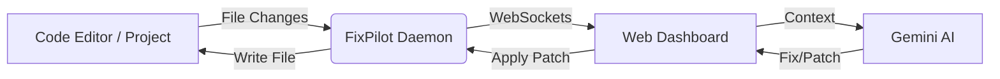

# FixPilot AI 🛸

> **The Universal AI Debugging Platform.**  
> Monitor runtime errors, analyze crashes with Gemini AI, and auto-apply code fixes in real-time.


## 🚀 Features

*   **Real-time Monitoring**: A background daemon watches your project files for changes and errors.
*   **AI Root Cause Analysis**: Instantly explains *why* a crash happened using Google Gemini Flash.
*   **Auto-Fix Engine**: Generates production-ready code patches to fix bugs automatically.
*   **Visual Dashboard**: Monitor project health, severity heatmaps, and error logs.
*   **Universal Editor Support**: Works with VS Code, IntelliJ, or any IDE via terminal agent.
*   **Environment Switching**: Toggle between "Local Dev" mode and "Production Traffic" simulation.

---

## 🛠️ Architecture

FixPilot consists of two main components:

1.  **The Daemon (Backend)**: A Node.js background service that watches your file system, runs syntax checks, and acts as the "Hands" to apply fixes.
2.  **The Dashboard (Frontend)**: A React + Vite application that acts as the "Brain", visualizing data and communicating with the AI.



---

## ⚡ Quick Start

### Prerequisites
*   Node.js (v18+)
*   A Google Gemini API Key (Get it [here](https://aistudiocdn.com/google-ai-studio))

### 1. Installation

Clone the repository and install dependencies:

```bash
git clone https://github.com/yourusername/fixpilot.git
cd fixpilot
npm install
```

### 2. Configuration

Create a `.env` file in the root directory:

```bash
VITE_API_KEY=AIzaSyYourGeminiKeyHere...
```

### 3. Running the Dashboard

Start the full stack (Dashboard + Default Daemon):

```bash
npm run dev
```

*   Open **http://localhost:3000** in your browser.

---

## 🔌 Connecting to Your Projects

FixPilot can debug **any external project** on your computer.

1.  **Open your target project** in VS Code (or your preferred editor).
2.  **Open a terminal** inside that project.
3.  **Run the FixPilot Daemon** pointing to that folder:

    ```bash
    # From the fixpilot directory
    node daemon/server.js "/path/to/your/target/project"
    ```

4.  **Check the Dashboard**:
    *   The status indicator will turn **Green (Agent Active)**.
    *   Any file you save in that project will now be scanned!

---

## 🧪 How to Test It

1.  **Connect** the daemon to a test folder.
2.  **Create a bug**: Make a file `buggy.js` with broken code:
    ```javascript
    function calculate() {
        return 10 * 
    } // Missing operand
    ```
3.  **Save the file**.
4.  **Watch the Dashboard**: It will instantly flag the syntax error.
5.  **Click "Analyze"**: See the AI explain the missing operand.
6.  **Click "Generate Fix"**: Review the corrected code.
7.  **Click "Confirm Fix"**: Watch the file in your editor automatically update!

---

## 📦 Tech Stack

*   **Frontend**: React, TypeScript, Vite, Tailwind CSS, Recharts, Lucide Icons.
*   **Backend**: Node.js, Express, Socket.io, Chokidar (File Watching).
*   **AI**: Google Gemini API (@google/genai).

## 👨‍💻 Developer

**FixPilot AI** was designed and developed by **Gagan M**.

*   **Vision**: To create a self-healing software ecosystem that bridges the gap between local debugging and production incident response.


## 📄 License

MIT License. Free to use and modify.
